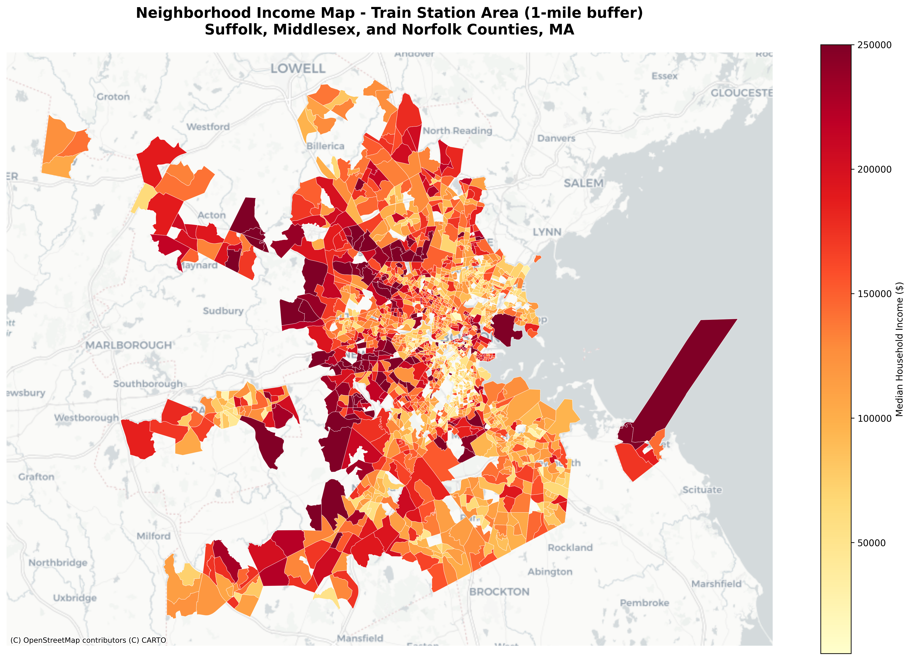
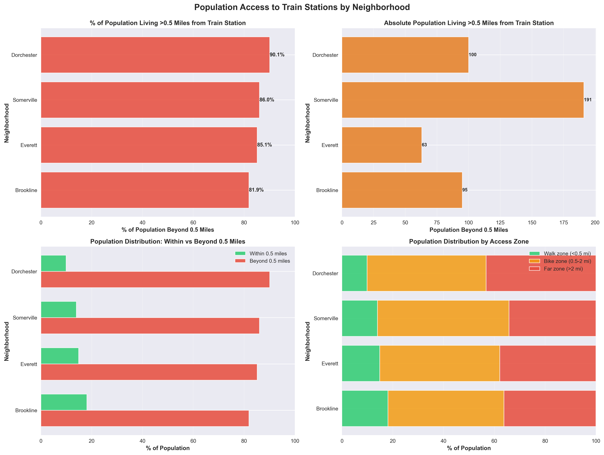

# MBTA System Challenge

## Project Overview

This project analyzes MBTA transit system accessibility and equity across neighborhoods in the Greater Boston area. We examine the relationship between income levels, geographic location, and access to public transportation, with a focus on identifying disparities in transit accessibility.

## Geographic Scope

This project focuses on three Massachusetts counties:
- **Suffolk County** (FIPS: 25025) - Includes Boston, Roxbury, Dorchester, Mattapan
- **Middlesex County** (FIPS: 25017) - Includes Cambridge, Somerville, Everett
- **Norfolk County** (FIPS: 25021) - Includes Brookline

## Problem Statement

Public transportation accessibility is a critical factor in urban equity. This analysis investigates:
- How income levels correlate with proximity to MBTA train stations
- Which neighborhoods have populations living beyond walking distance (>0.5 miles) from train stations
- Whether there are disparities in transit access between high-income and low-income areas
- The distribution of transit vs. bike usage across different regions

## Key Visualizations

### 1. Income Distribution Map

The following map shows median household income by census block group across the study area:



This choropleth map visualizes income disparities across neighborhoods, with warmer colors (yellow/orange/red) indicating higher median household income.

### 2. Income Map with MBTA Train Stations

This map overlays MBTA train stations (Heavy Rail, Light Rail, and Commuter Rail) on the income distribution:


Blue dots represent MBTA train stations, allowing us to visually assess the relationship between income levels and station locations.

### 3. Population Accessibility by Neighborhood

This chart shows the percentage of each neighborhood's population living more than 0.5 miles from the nearest train station:



The analysis categorizes accessibility into zones:
- **Walk-zone**: <0.5 miles (within walking distance)
- **Bike-zone**: 0.5-2 miles (bikeable distance)
- **Far-zone**: >2 miles (requires other transportation)

## Data Sources

- **ACS Income Data (B19013)**: Median Household Income from American Community Survey
  - Source: [Census Bureau](https://data.census.gov/cedsci/)
- **ACS Population Data (B01003)**: Total Population by Census Block Group
  - Source: [Census Bureau](https://data.census.gov/cedsci/)
- **Block Group Shapefiles**: Geographic boundaries
  - Source: [Census TIGER/Line Files](https://www.census.gov/geographies/mapping-files/time-series/geo/tiger-line-file.html)
- **MBTA GTFS Data**: Transit stops, routes, and schedules
  - Source: [MBTA GTFS](https://www.mbta.com/developers/gtfs)
  - Files used: `stops.txt`, `routes.txt`, `trips.txt`, `stop_times.txt`
- **OpenStreetMap**: Street network data for walking distance calculations
  - Used for network-based distance analysis

## Methodology

### Step 1: Merge ACS Income with Block-Group Shapefiles
- Merge ACS income data (B19013) with block-group shapefiles using GEOID
- Filter for Suffolk, Middlesex, and Norfolk counties
- Create neighborhood income map
- **Script**: `scripts/step1_merge_acs_income.py`
- **Output**: `data/neighborhood_income_merged.geojson`

### Step 2: Transit Station Accessibility Analysis
- Load MBTA GTFS stops.txt and filter for train stations (route_type: 0, 1, 2)
- Compute distance from each block group centroid to nearest train station
- Use network-based walking distances (OpenStreetMap) for accurate path calculations
- Categorize into accessibility zones:
  - **walk-zone**: 0-0.5 miles
  - **bike-zone**: 0.5-2 miles
  - **far-zone**: 2+ miles
- Merge with income data from Step 1
- Add population (B01003) data
- **Scripts**: 
  - `create_complete_accessibility_analysis.py` - Full analysis
  - `create_neighborhood_walking_accessibility.py` - Network-based walking distances
  - `create_population_accessibility_chart.py` - Neighborhood-level charts
- **Output**: Various CSV and visualization files

### Step 3: Income-Based Analysis
- Analyze top 30% and bottom 30% income block groups
- Compare distance to train stations by income level
- Generate equity visualizations
- **Scripts**: 
  - `analyze_top_income_block_groups.py`
  - `analyze_bottom_income_block_groups.py`
  - `create_income_by_region_chart.py`

### Additional Analyses
- **Transit vs. Bike Usage**: `create_transit_bikes_chart.py`
- **Mode by Age and Region**: `analyze_excel_files.py`
- **Income Map with Stations**: `create_income_map_with_stations.py`

## Setup & Installation

### Prerequisites
- Python 3.8 or higher
- pip package manager

### Installation Steps

```bash
# Clone the repository
git clone https://github.com/jessie1007/MBTA-system-challenge.git
cd MBTA-system-challenge

# Install dependencies
pip install -r requirements.txt
```

### Data Setup

1. **Download MBTA GTFS Data** (if not already present):
   ```bash
   # The MBTA_GTFS directory should contain the GTFS files
   # If missing, download from: https://cdn.mbta.com/MBTA_GTFS.zip
   # Extract to MBTA_GTFS/ directory
   ```

2. **Ensure Data Files Are Present**:
   - `data/block_groups.shp` - Block group shapefiles
   - `data/acs_income_b19013.csv` - ACS income data
   - `MBTA_GTFS/stops.txt`, `routes.txt`, `trips.txt`, `stop_times.txt` - GTFS data

## Usage

### Generate Income Map with Stations

```bash
python3 scripts/create_income_map_with_stations.py
```

This creates `neighborhood_income_map_with_stations.png` showing income distribution with MBTA stations overlaid.

### Analyze Population Accessibility by Neighborhood

```bash
python3 scripts/create_population_accessibility_chart.py
```

This generates `population_accessibility_by_neighborhood.png` showing the percentage of each neighborhood's population living beyond 0.5 miles from train stations.

### Analyze Income vs. Accessibility

```bash
# Top 30% income block groups
python3 scripts/analyze_top_income_block_groups.py

# Bottom 30% income block groups
python3 scripts/analyze_bottom_income_block_groups.py
```

### Create Complete Accessibility Analysis

```bash
python3 scripts/create_complete_accessibility_analysis.py
```

This performs the full analysis including distance calculations, zone assignments, and generates multiple output files.

### Generate Transit vs. Bike Usage Charts

```bash
python3 scripts/create_transit_bikes_chart.py
```

### Generate Income by Region Charts

```bash
# By county
python3 scripts/create_income_by_region_chart.py county

# By census tract
python3 scripts/create_income_by_region_chart.py tract

# Top N tracts
python3 scripts/create_income_by_region_chart.py tract 20
```

### Run Step-by-Step Analysis

```bash
# Step 1: Merge ACS income data with block groups
python3 scripts/step1_merge_acs_income.py

# Step 2: Calculate transit accessibility
python3 scripts/step2_transit_accessibility.py

# Step 3: Create equity visualizations
python3 scripts/step3_equity_visualization.py
```

## Key Findings

[Add your key findings and insights here]

### Sample Insights:
- X% of low-income residents live beyond 0.5 miles from train stations
- Y% of high-income residents live within walking distance (<0.5 miles)
- Neighborhood Z has the highest percentage of population with limited transit access

## Distance Calculation Methods

### Straight-Line Distance (Initial Analysis)
- Quick calculation from block group centroids to nearest station
- Underestimates actual walking distance by 20-40%
- Used in initial analyses

### Network-Based Walking Distance (Advanced Analysis)
- Uses OpenStreetMap street network data
- Calculates actual walking paths along streets
- More accurate representation of accessibility
- Implemented in `scripts/calculate_walking_distances.py` and `scripts/create_neighborhood_walking_accessibility.py`

## Project Structure

```
MBTA-system-challenge/
├── data/                          # Data files (ignored in git)
│   ├── block_groups.shp          # Block group shapefiles
│   ├── acs_income_b19013.csv     # ACS income data
│   ├── gtfs/                     # GTFS data (if using data/gtfs)
│   └── *.geojson                 # Merged data outputs
├── MBTA_GTFS/                    # MBTA GTFS data (ignored in git)
│   ├── stops.txt
│   ├── routes.txt
│   ├── trips.txt
│   └── stop_times.txt
├── docs/
│   └── images/                   # Documentation images
│       ├── neighborhood_income_map.png
│       ├── neighborhood_income_map_with_stations.png
│       └── population_accessibility_by_neighborhood.png
├── scripts/                       # Analysis scripts
│   ├── step1_merge_acs_income.py     # Step 1: Merge income data
│   ├── step2_transit_accessibility.py # Step 2: Accessibility analysis
│   ├── step3_equity_visualization.py  # Step 3: Visualizations
│   ├── create_income_map_with_stations.py  # Income map with stations
│   ├── create_population_accessibility_chart.py  # Accessibility charts
│   ├── create_complete_accessibility_analysis.py  # Full analysis
│   ├── create_neighborhood_walking_accessibility.py  # Walking distance analysis
│   ├── calculate_walking_distances.py  # Network-based distances
│   ├── load_mbta_stations.py  # MBTA station loader
│   ├── analyze_top_income_block_groups.py  # Top income analysis
│   ├── analyze_bottom_income_block_groups.py  # Bottom income analysis
│   ├── create_transit_bikes_chart.py  # Transit vs bike usage
│   ├── create_income_by_region_chart.py  # Income by region
│   ├── create_region_population_accessibility.py  # Region accessibility
│   └── analyze_excel_files.py  # Excel data analysis
├── requirements.txt              # Python dependencies
└── README.md                     # This file
```

## Technologies Used

- **Python** - Primary programming language
- **Pandas** - Data manipulation and analysis
- **GeoPandas** - Geospatial data analysis
- **Shapely** - Geometric operations
- **OSMnx & NetworkX** - Street network analysis and walking distance calculations
- **Geopy** - Distance calculations (initial analyses)
- **Matplotlib & Seaborn** - Data visualization
- **Contextily** - Basemap tiles for maps

## Limitations & Future Work

### Current Limitations:
- Neighborhood mapping uses approximate methods (county + income patterns)
- Some analyses use straight-line distance (less accurate than network-based)
- GTFS data may be outdated (should be refreshed periodically)

### Future Improvements:
- Use official neighborhood boundary shapefiles
- Implement real-time GTFS data updates
- Add more detailed demographic analysis (age, race, vehicle ownership)
- Include bus routes in accessibility analysis
- Create interactive web visualizations

## Contributing

[Add contribution guidelines if applicable]

## License

[Add license information]

## Contact

[Add contact information]

## Acknowledgments

- MBTA for providing GTFS data
- U.S. Census Bureau for ACS and TIGER/Line data
- OpenStreetMap contributors for street network data
